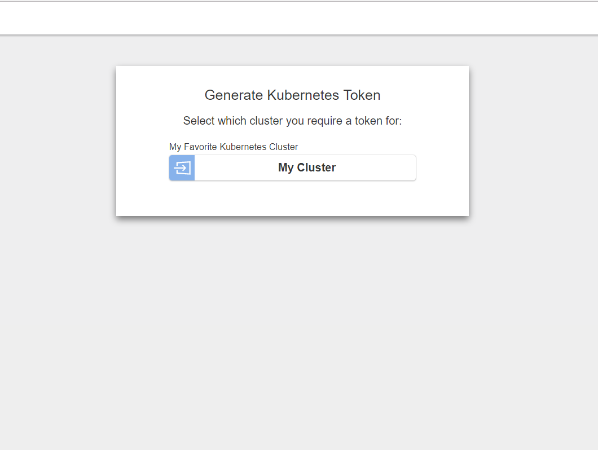
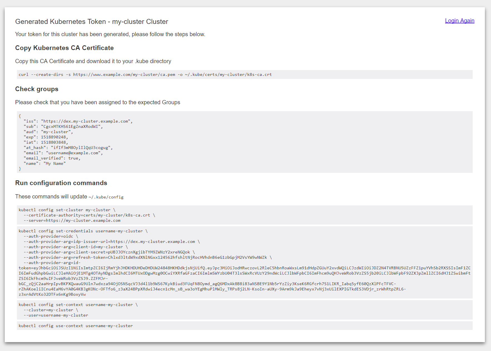

# Dex K8s Authenticator

A helper web-app which talks to one or more [Dex Identity services](https://github.com/dexidp/dex) to generate
`kubectl` commands for creating and modifying a `kubeconfig`.

The Web UI supports generating tokens against multiple cluster such as Dev / Staging / Production. 

## Also provides
* Helm Charts
* SSL Support
* Linux/Mac/Windows instructions

## Documentation

- [Developing and Running](docs/develop.md)
- [Configuration Options](docs/config.md)
- [Using the Helm Charts](docs/helm.md)
- [SSL Support](docs/ssl.md)

## Screen shots

## Contributing

Feel free to raise feature-requests and bugs. PR's are also very welcome.

## Alternatives

- https://github.com/heptiolabs/gangway
- https://github.com/micahhausler/k8s-oidc-helper
- https://github.com/negz/kuberos
- https://github.com/negz/kubehook
- https://github.com/fydrah/loginapp

This application is based on the original [example-app](https://github.com/coreos/dex/tree/master/cmd/example-app
) available in the CoreOS Dex repo.
